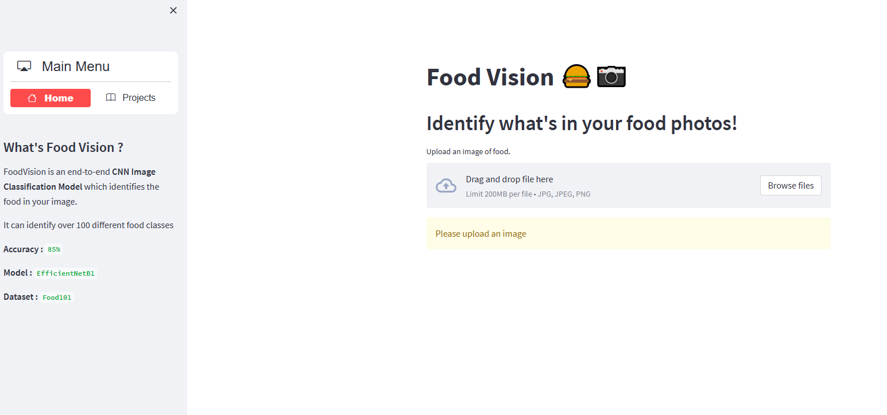

<!-- ABOUT THE PROJECT -->
## About The Project


FoodVision is an end-to-end CNN Image Classification Model which identifies the food in your image.


### Installation


1. Clone the repo
   ```sh
   git clone https://github.com/lgbao123/food-101.git
   ```
3. Install packages
   ```sh
   python -m venv venv
   venv\Scripts\activate
   pip install -r requirements.txt
   ```
4. Run app
   ```sh
   streamlit run app.py
   ```


### To view the Deployed app, [Click here](https://lgbao123-food-101-app-fevm27.streamlit.app/)

> The app may take a couple of seconds to load for the first time, but it works perfectly fine.




